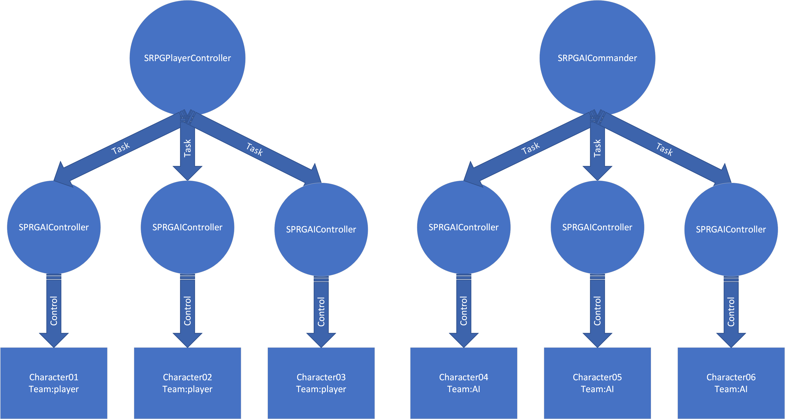

使用UE4制作SRPG
===============

本文不是手把手UE4入门教程，你需要了解UE4的基本运作机制：

* 了解UE4的GameMode，PlayerController，AIController，Character，Actor，Object
* 了解UE4的接口(Interface)
* 能够编写blueprint代码
* C++不是必须，虽然本文所提供的样例工程是由C++和blueprint混合编写，但大部分功能blueprint都能实现

项目地址： SRPGTemplate_

Controller设置
--------------

我们定义三个Controller类：

* SRPGAIController：继承自AIController，用来接收指令，执行特定操作
* SRPGAICommander：继承自AIController，代表真正意义上的AI
* SRPGPlayerController：继承自PlayerController，代表玩家

所有Character都由SRPGAIController控制，Player或者AICommander无法直接控制Character，需要通过向SRPGAIController发送指令来执行 **移动**， **攻击** 等操作。

这样设计能让逻辑更加清晰易懂，以及让某些功能实现起来更加容易。

回合制
------

定义一个TBPlayer(Turn-based player)接口，SRPGPlayerController、SRPGAICommander都实现此接口。

GameMode维护一个TBPlayer队列，在游戏开始时收集/构造所有的TBPlayer并加入队列。 [#f1]_ 

TBPlayer中定义一个OnEnterMyTurn函数，GameMode保存了所有的TBPlayer信息，当进入某个Player的回合时，
调用TBPlayer::OnEnterMyTurn通知此此Player进行相关操作(移动、攻击、使用技能和物品)，同时对其他Player和相关Character施加约束：

#. 如果 **其他Player** 是玩家：隐藏某些UI，禁用某些事件 [#f2]_ 
#. 如果 **其他Player** 是AI：禁止它向SRPGAIController发送指令
#. 对于Character：如果当前Player不是它的操纵着，那么它无法执行任何指令

通过施加上述约束，使游戏按回合进行。

.. note:: 在战场女武神或者XCom2中，即使不在自己的回合，角色也能做出某些行动，比如攻击视野中移动的敌人，
   可以通过修改上述第三条约束，让角色在不是自己回合时做出受限制的行动，这些行动自动触发，无需接收指令

GameMode提供NextPlayer函数，让Player在执行完相关操作之后结束自己的回合，当所有的Player都完成操作时，游戏的回合数+1。

网格
----

我的 Grid_ 插件实现了网格相关的功能，由C++编写，blueprint可以使用、扩展，你也可以选择自己实现。

主要的功能需求如下：

* 网格查询：根据坐标、中心网格+范围、位置等信息查询相关网格
* 网格绘制：将网格信息展现给玩家，Grid插件提供贴花(Decal)和轮廓线(Outline, XCom2-like)两种绘制方式
* 基于网格的寻路(Grid-based pathfinding)：给出指定坐标，返回网格数组
* 基于网格的运动(Grid-based movement)：让Character沿着网格移动，而不是UE4的默认MoveTo行为(你也可以这么做，XCom2就是例子)
* 路线绘制：将移动路线展示给玩家，可以使用decal、Particle System或者其他方法，根据游戏需求而定，Grid插件的PathGuide使用UE4的FPrimitiveDrawInterface(PDI)绘制路线，并可以在起点和中点设置不同的贴花(XCom2-like)

.. note:: 如果你自己实现网格相关功能，并且只用blueprint，网格的绘制最好的办法可能是贴花(decal)，Blueprint无法访问PDI接口，没办法直接画线，实现网格轮廓线可能比较麻烦，ProceduralMeshComponent+特殊的材质可能是个办法，但我没有验证过。

AI 
---

定义SRPGTask类，一个SRPGTask代表某个Character可以执行的任务(移动、攻击、使用技能等等)。

AICommander的逻辑如下：

1. 检查是否存在可行动的角色，如果不存在则结束回合，否则执行以下逻辑
2. 生成所有可控角色的所有可执行的SRPGTask
3. 评估每个SRPGTask的Utility(Utility的解释见下文)
4. 根据Utility删除明显不合理的Task
5. 根据Utility随机选择一个SRPGTask执行
6. 等待SRPGTask执行完成，然后回到1

.. note:: Utility是一个[0,1]的浮点数，用来表示SRPGTask的合理度，0表示及其愚蠢的Task，1表示执行此Task可获得胜利，其他Task的Utility位于此之间。
   Utility的评估函数直接影响AI的行为，是实现合理AI的关键。

如何评估Utility：

SRPGTask提供一个GetExecuteResult函数，获取Task的执行(预测)结果FTaskExecuteResult，包含以下信息：

* FinalPostion：执行此Task之后，Character的最终位置
* ApplyDamageInfoList：Character能对敌人造成多少伤害
* TakeDamageInfoList：Character可能受到多少伤害
* ApplyHealingInfoList：Character能治疗多少友军
* TakeHealingInfoList：Character能受到多少治疗

评估函数获取Task的FTaskExecuteResult之后，评估以上信息，返回最终的Utility。

评估函数的实现可以包含sub-utility，比如PositionUtility，DamageUtility，HealingUtility，分别评估位置、伤害和治疗然后再将它们合并成最终的Utility，样例公式如下：

``Utility = PositionUtility*PositionWeight + DamageUtility*DamageWeight + HealingUtility*HealingWeight``

当Character生命值较高时，赋予DamageWeight相对较高的值，使角色倾向于进攻，当Character生命值较低时，赋予PositionWeight和HealingWeight相对较高的值，使角色倾向于逃跑和寻找治疗。

.. note:: sub-utility的计算可以自由设计，值域也可以不受限制，但必须保证最终Utility位于[0,1]，确保各个SRPGTask之间是可比较的，如果Task1的Utility大于Task2，那么Task1应该优于Task2。

Utility评估完成后，AICommander要选择其中一个执行，选择的逻辑如下:

* 删除Utility非常低的Task
* 对于剩下的SRPGTask，求出它们的Utility之和TotalUtility
* 计算出各个Task被选择的概率 Probability = Utility / TotalUtility
* 根据计算出来的概率，随机选择一个Task

示例：

假设我们有5个Task::

    T1：移动到点A
    T2: 移动到点B
    T3：移动到点C，获取某个道具
    T4：移动到点D，获取治疗
    T5：移动到点E，攻击某个敌人

* 评估他们的Utility，分别为U1=0.01, U2=0.1, U3=0.5, U4=0.6, U5=0.8
* T1的Utility为0.01实在太低，我们把T1直接排除，剩下T2,T3,T4,T5
* 求出TotalUtility = 0.1 + 0.5 + 0.6 + 0.8 = 2
* 算出T2,T3,T4,T5的概率分别为P2 = 0.1/2 = 0.05，P3 = 0.5/2 = 0.25，P4 = 0.6/2 = 0.3，P5 = 0.8/2 = 0.4
* 从T2,T3,T4,T5中随机选出一个Task执行，选中T2的概率为5%，T3的概率为25%，T4的概率为30%，T5的概率为40%

.. note:: 随机选择一个Task而不是选择最优解是因为如果总是选择最优解会让AI行为看起来很假，有时还会让玩家的SL大法失效，影响游戏体验。

关于Utility更详细的介绍可以参考

`Game AI Pro: Collected Wisdom of Game AI Professionals`_

    Chapter 9  An Introduction to Utility Theory

    Chapter 10 Building Utility Decisions into Your Existing Behavior Tree

`Game AI Pro 2: Collected Wisdom of Game AI Professionals`_

    Chapter 3 Dual-Utility Reasoning

伤害计算
--------

    TODO

.. [#f1] 大部分情况下只有两个TBPlayer，玩家和AI，如果存在玩家不可操作的友军，那么会出现第三个Player，三个以上比较少见。
.. [#f2] 比如隐藏 **下一回和** 按钮，禁止选中角色等

.. _Grid: https://github.com/jinyuliao/Grid
.. _SRPGTemplate: https://github.com/jinyuliao/SRPGTemplate
.. _`Game AI Pro: Collected Wisdom of Game AI Professionals`: https://www.amazon.com/Game-AI-Pro-Collected-Professionals/dp/1466565969/ref=sr_1_2?s=books&ie=UTF8&qid=1511454480&sr=1-2
.. _`Game AI Pro 2: Collected Wisdom of Game AI Professionals`: https://www.amazon.com/Game-AI-Pro-Collected-Professionals/dp/1482254794/ref=sr_1_3?s=books&ie=UTF8&qid=1511454480&sr=1-3

.. author:: default
.. categories:: none
.. tags:: none
.. comments::
