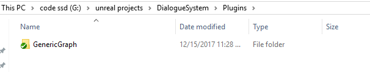
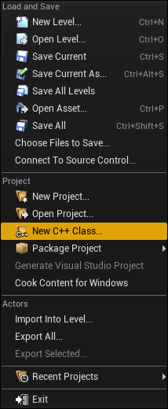
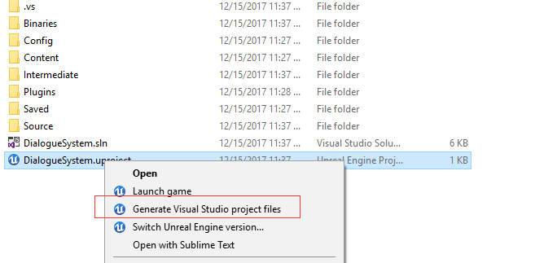
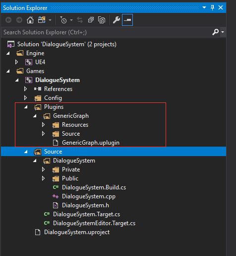

UE4 Dialogue System Part1
=========================

Introduction
------------

This tutorial create a Fire Emblem-like dialogue system in UE4 with my GenericGraph_ plugin.

.. image:: https://raw.githubusercontent.com/jinyuliao/GenericGraph/master/docs/images/dialogue/dialogue03.png

Prerequisite:

* UE4 version: 4.18.2 or higher
* C++ development enviroment(Visual Studio on Windows or Xcode on Mac)
* Some experience with UE4, can make simple UI with UMG

In this part, we wiil create a demo project and compile the plugin.

Step 1
------

Create a blueprint project with the TopDown template.

.. thumbnail:: images/create_project.png

Step 2
------

Open your porject's root folder, create a folder named "**Plugins**", clone GenericGraph_ into the "**Plugins**" folder.

Step 3
------

In your editor, click "File->New C++ Class".

Click "Next".

.. thumbnail:: images/class_wizard_01.png

Set the class name to "Placeholder"

.. thumbnail:: images/class_wizard_02.png

Click "Create Class".

.. note:: Now we have created a c++ class: Placeholder, as the name implies, it's a placeholder, we don't need it anymore, we just need a c++ class to generate a c++ project.

Right click your "YourProject.uproject" file, click "Generate Visual Studio project files".

Open YourPorject.sln file, you should see the GenericGraph plugin's files now.

**Close your project editor**, then compile the c++ solution(F7).

Step 4
------

If compile succeeded, open your editor again, right click in your content browser, you can create GenericGraph asset now.

.. thumbnail:: images/generic_graph_asset.png

Done
----

That’s all in this part, you have created a project and compiled the GenericGraph plugin, we will add a "DialogueSession" asset in the next part, then say goodbye to c++ and dive into blueprint.

Part2_

.. _GenericGraph: https://github.com/jinyuliao/GenericGraph
.. _Part2: https://jinyuliao.github.io/blog/html/2017/12/15/ue4_dialogue_system_part2.html

.. author:: default
.. categories:: UE4 Dialogue System
.. tags:: UE4, Tutorial
.. comments::
