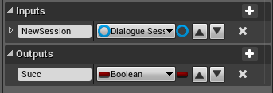
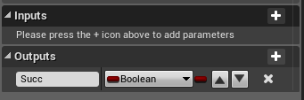
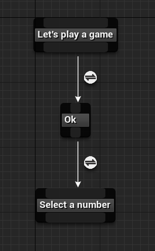

UE4 Dialogue System Part3
=========================

Part2_

In this part, we will create a dialogue widget which use DialogueSession asset as input to display dialogue on screen.

.. thumbnail:: images/dialogue_session_to_screen.png

Step 1
------

Create an UMG widget: UI_Dialogue, like this:

.. thumbnail:: images/dialogue_widget_layout.png

Step 2
------

Create function: *StartSession* and *Next*.

StartSession's function signature:

Next's function signature:

Create some variables:

* CurrentSession: DialogueSession(type)
* CurrentDialogueNode: DialogueSessionNode(type)
* NodeIndex: Integer(type)

bind MainText's *Text* field to CurrentDialogueNode's *Paragraph* property, like this:

.. thumbnail:: images/dialogue_main_text_bind.png

Step 3
------

Implement function: *StartSession*

.. thumbnail:: images/start_session_impl.png

Step 4
------

Implement function: *Next*

.. thumbnail:: images/next_impl.png

Step 5
------

Create a DialogueSession asset: Dialogue_Test

Step 6
------

Create a UMG widget: UI_HUD, layout it like this:

.. thumbnail:: images/hud_layout.png

create a bind for UI_Dialogue's *Visibility*:

.. thumbnail:: images/dialogue_visibility_bind.png

Step 7
------

Setup input action mapping: *Next*

.. thumbnail:: images/next_input.png

create an UI_HUD widget, add it to viewport and setup for *Next* event:

.. thumbnail:: images/controller_setup.png

Step 8
------

Add a test trigger into your test map

.. thumbnail:: images/test_trigger.png

open **Level Blueprint**, setup BeginOverlap event like this:

.. thumbnail:: images/test_trigger_overlap.png

Step 9
------

Play. move character to the position of test trigger, now you can see the dialogue widget. press **N** goto the next paragraph.

Done
----

That’s all in this part. In the next part, we wiil support dialoguer information such as: name, portrait image.

.. _Part2: https://jinyuliao.github.io/blog/html/2017/12/15/ue4_dialogue_system_part2.html

.. author:: default
.. categories:: UE4 Dialogue System
.. tags:: UE4, Tutorial
.. comments::
